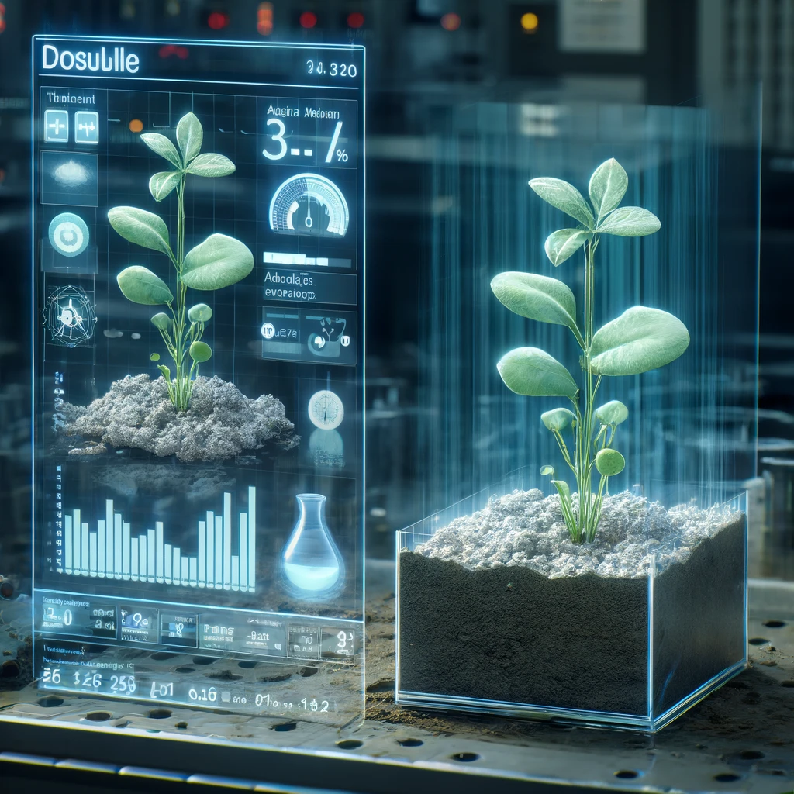
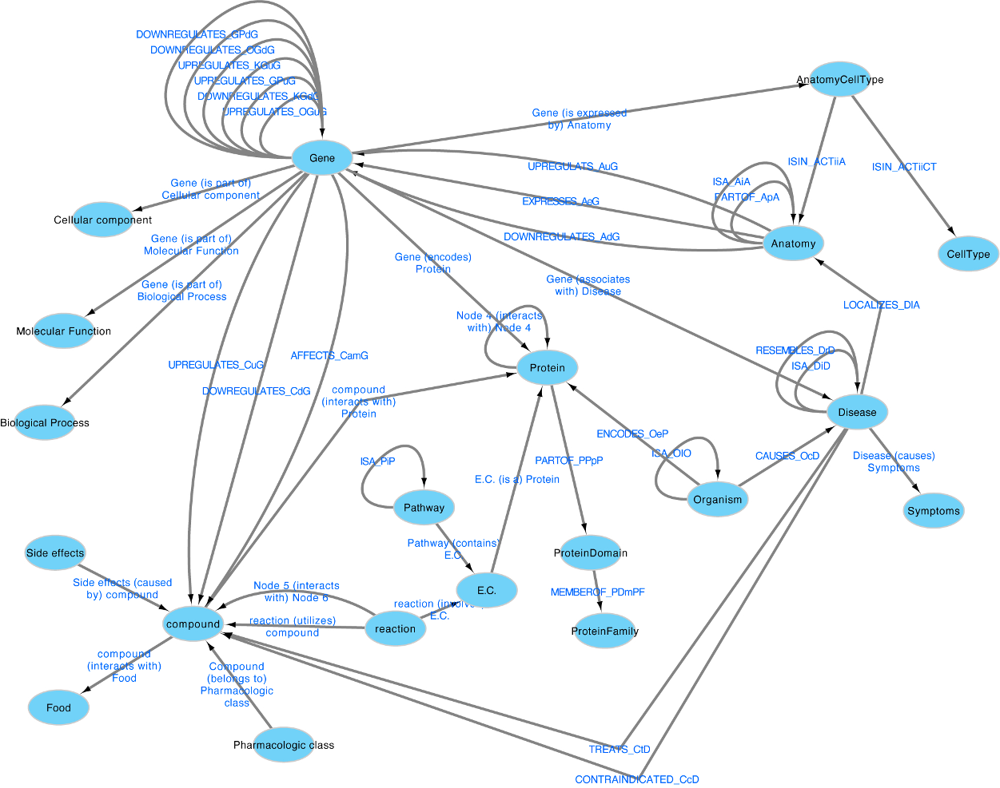

# Future work: digital doubles

> Ported verbatim (minus GitBook markup) from `future-work-digital-doubles/README.md` in
> [Lunar_regolith_AWG](https://github.com/dr-richard-barker/Lunar_regolith_AWG).
> This is the original written record. The analysis that supersedes parts of it
> lives in `results/` and is reproducible from `scripts/`.

---

---
description: Can we use developmental stage to mine EBI and make a digital double?
---

# Future Work: Digital doubles

Can we use analysis of differential expression of the real regolith to find studies on Earth that are similar using the European Bioinformatics Instiuotes expression atlas data?

[More information on the EBI expression atlas API syntax can be found here](https://github.com/gxa/atlas_gsa/tree/master)

*Image featuring the Arabidopsis plant in grey soil next to its digital double hologram, with a dashboard of readouts. Each detail, from the plant's replication in the hologram to the futuristic dashboard, DALLE4*

**I think a digital double contains all these components.** 

