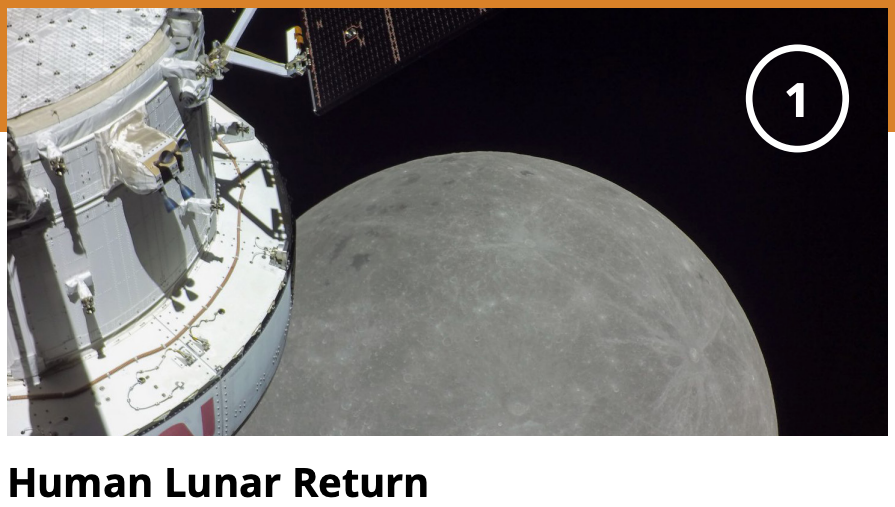
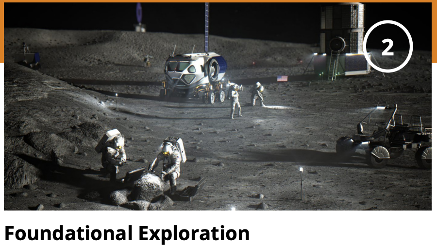
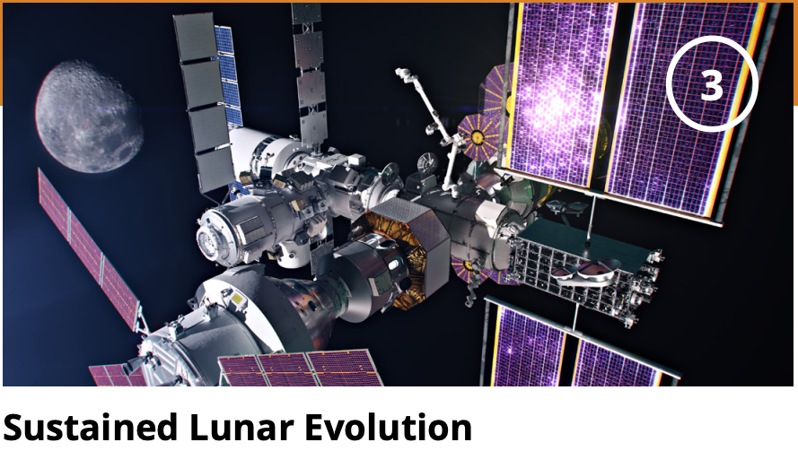
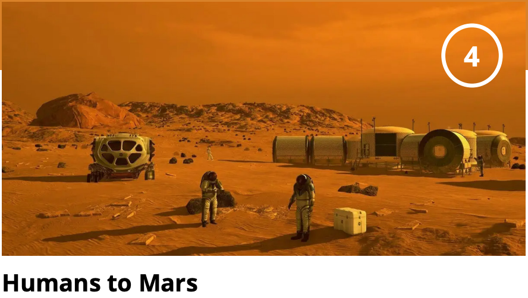

# Exploration lesson plan

> Ported verbatim (minus GitBook markup) from `exploration-lesson-plan.md` in
> [Lunar_regolith_AWG](https://github.com/dr-richard-barker/Lunar_regolith_AWG).
> This is the original written record. The analysis that supersedes parts of it
> lives in `results/` and is reproducible from `scripts/`.

---

**Introduction**

**Student question/ Goal: How to weave plants and agriculture into this narrative?**

**Stage 1:**

**Stage 2:**

**Stage 3:**

**Stage 4:**

**Conclusion:  the future has yet to be written...**

**What did you learn?**
